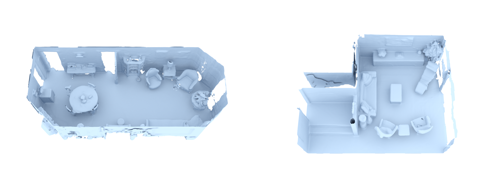

# mitsuba-visualize: Automates High-Quality Mitsuba Renders

Visualizes meshes, pointclouds and video flythroughs in publication quality
- Collection of scripts automating path-traced rendering with [mitsuba (0.6.0)](https://www.mitsuba-renderer.org/index_old.html), directly using their python API.
- Can also render flythroughs from predefined camera poses using bezier curves and catmull-rom splines

This implementation was used for the visualizations in *Dai, Angela, Christian Diller, and Matthias Nießner. "SG-NN: Sparse Generative Neural Networks for Self-Supervised Scene Completion of RGB-D Scans."* (CVPR'20)



You can find more samples, including flythroughs, in our [SG-NN video](https://www.youtube.com/watch?v=rN6D3QmMNuU).


## Installation

1. Install mitsuba 0.6.0, following the tutorial here: [10 Steps to Install Mitsuba Renderer on Ubuntu](https://medium.com/@sreenithyc21/10-steps-to-install-mitsuba-renderer-on-ubuntu-38a9318fbcdf)
2. Clone this repository and install python dependencies:   
```bash
git clone https://github.com/chrdiller/mitsuba-visualize
cd mitsuba-visualize
poetry install
```
3. After building mitsuba, adjust path in ``set_python_path.py`` to point to the folder you cloned mitsuba to (has to contain subdirectory ``dist/python``)
```bash
MITSUBA_BASE = Path('/path/to/mitsuba/clone')
```


## Usage
Enter environment: ``poetry shell``  

### Single images
- Meshes: ``python mesh.py ...``
```bash
usage: mesh.py [-h] -o OUTPUT [--scenes_list SCENES_LIST] [--scene SCENE]
               [--cameras CAMERAS] [--width WIDTH] [--height HEIGHT]
               [--samples SAMPLES] [--workers WORKERS]
               [input_paths [input_paths ...]]

Render directory

positional arguments:
  input_paths           Path(s) to directory containing all files to render

optional arguments:
  -h, --help            show this help message and exit
  -o OUTPUT, --output OUTPUT
                        Path to write renderings to
  --scenes_list SCENES_LIST
                        Path to file containing filenames to render in base
                        path
  --scene SCENE         One scene. Overrides scenes_list
  --cameras CAMERAS     XML file containing meshlab cameras
  --width WIDTH         Width of the resulting image
  --height HEIGHT       Height of the resulting image
  --samples SAMPLES     Number of integrator samples per pixel
  --workers WORKERS     How many concurrent workers to use
```

- Point Clouds: ``python pointcloud.py ...``
```bash
usage: Render pointcloud with mitsuba by placing little spheres at the points' positions
       [-h] -o OUTPUT [--radius RADIUS] [--width WIDTH] [--height HEIGHT]
       [--samples SAMPLES] [--workers WORKERS]
       input [input ...]

positional arguments:
  input                 Path(s) to the ply file(s) containing a pointcloud(s)
                        to render

optional arguments:
  -h, --help            show this help message and exit
  -o OUTPUT, --output OUTPUT
                        Path to write renderings to
  --radius RADIUS       Radius of a single point
  --width WIDTH         Width of the resulting image
  --height HEIGHT       Height of the resulting image
  --samples SAMPLES     Number of integrator samples per pixel
  --workers WORKERS     How many concurrent workers to use
```

### Flythroughs
As in the [SG-NN video](https://www.youtube.com/watch?v=rN6D3QmMNuU)

- (Optional) Export cameras from meshlab
    - Open the mesh in meshlab and press ``Cmd/Ctrl + C`` to copy the current camera view
    - Paste into a text editor (will be a few lines of XML)
    - Save as xml file
    - Repeat for every camera keypoint
- (Alternatively) Do not specify cameras; this will render a slightly tilted top-down turntable view
- Usage: ``python flythough.py ...``
```bash
usage: Render a flythrough video of a scene [-h] -o OUTPUT
                                            [--remote [REMOTE [REMOTE ...]]]
                                            [--novideo] [--norender] [--keep]
                                            [--scenes_list SCENES_LIST]
                                            [--frames FRAMES]
                                            [--cameras CAMERAS]
                                            [--shutter_time SHUTTER_TIME]
                                            [--width WIDTH] [--height HEIGHT]
                                            [--fov FOV] [--samples SAMPLES]
                                            [--interpolation {catmullrom,bezier}]
                                            [--workers WORKERS]
                                            input [input ...]

positional arguments:
  input                 Path to the ply file to render

optional arguments:
  -h, --help            show this help message and exit
  -o OUTPUT, --output OUTPUT
                        Path to write output video to
  --remote [REMOTE [REMOTE ...]]
                        Urls of the remote render servers
  --novideo             Only render frames, do not produce video
  --norender            Only render video from existing frames, no rendering
  --keep                Whether to keep the frame images
  --scenes_list SCENES_LIST
                        Path to file containing filenames to render in base
                        path
  --frames FRAMES       Number of frames to render (The video file will have
                        30fps)
  --cameras CAMERAS     XML file containing meshlab cameras (or path to
                        directory only containing such files). If set, this is
                        used for spline interpolation. Otherwise, a rotating
                        flyover is generated
  --shutter_time SHUTTER_TIME
                        Shutter time of the moving sensor
  --width WIDTH         Width of the resulting image
  --height HEIGHT       Height of the resulting image
  --fov FOV             Field of view of the sensor in degrees (meshlab
                        default is 60)
  --samples SAMPLES     Number of integrator samples per pixel
  --interpolation {catmullrom,bezier}
                        Which method to use for interpolation between control
                        points
  --workers WORKERS     How many local concurrent workers to use
```
